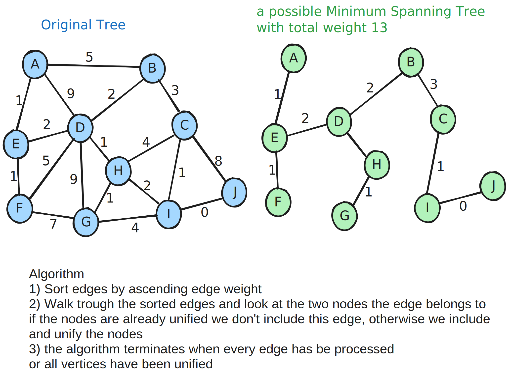

# Union Find - Disjoint Set
Data structure that keeps track of elements which are split into one or more disjoint sets.

has 2 primary operations 
- find() - For given element, tells what union that data belongs to.
- union() - merges 2 groups together.

## Usage
- image processing
- network connectivity
- least common ancestor in trees
- grid percolation - for given dots on a x/y grid, is there a path from top to bottom
- Kruskal's minimum spanning tree algorithm

## Complexity
|  |  |
|---|---|
| Construction | O(n) |
| Union | α(n) |
| Find | α(n) |
| get component size | α(n) |
| check if connected | α(n) |
| count components | O(n) |
|  |  |
- `α(n)` in amorthized constant time (almost constant, but not mathematically)

### Algorithm Kruskal's Minimum Spanning Tree
Given a graph we want to find a minimum Spanning Tree in the graph.
- A minimum spanning tree is a subset of the edges which connect all vertices in the graph with the minimal total edge cost.

