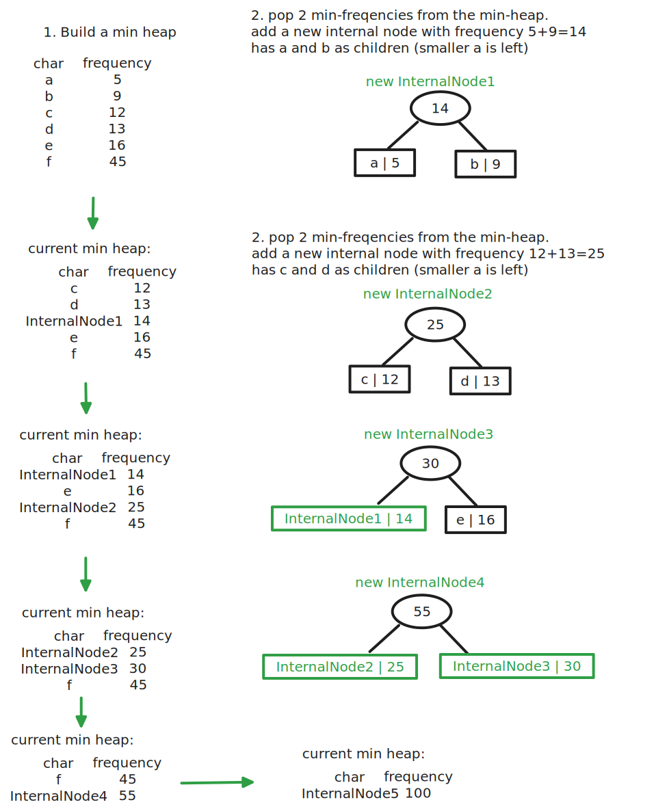

# Huffman Coding Algorithm - Lossless data compression
Huffman coding is a lossless data compression algorithm.
- variable length codes assigned to input characters are **prefix codes**.
- Ex: `a -> 01` `b -> 11` `c -> 10`  
- special care has to be taken so there is no ambiguity. (so prefix precedence order is important)
- the method which is used to construct optimal prefix code is called huffman coding.

This method builds a tree in bottom up manner.

## Stepts to build a Huffman Tree
1. Create a leaf node for each unique character. Build a priority queue (min heap) of all leaf nodes. The frequency field is used to compare two nodes in min heap. The least frequent char is at the root.
2. Extract two nodes with the minimum frequency from the min heap.
3. Create a new internal node with frequency equals to sum of those 2 nodes frequencies. Make the first extracted node as left child, theother extracted node right child. Add this node to the min heap.
4. Repeat steps 2 and 3 till heap contains only 1 node. the remaining node is the root node and the tree is complete.

